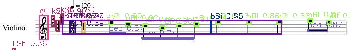

# Notação Musical

Este projeto tem como objetivo a **transcrição automática de partituras musicais** a partir de imagens digitalizadas, empregando técnicas de processamento de imagem e **Optical Music Recognition (OMR)**.  
O sistema realiza a identificação e a interpretação dos símbolos musicais, permitindo a conversão da partitura visual em uma representação musical estruturada.

## Exemplo de Transcrição da Partitura

A imagem abaixo apresenta uma partitura tratada e rotulada, ilustrando o processo de identificação dos símbolos musicais que fundamenta a **transcrição da notação musical**:

